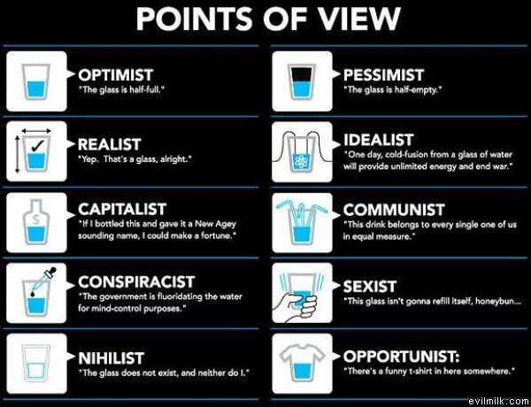

# Applied Data Science @ Columbia
## Fall 2022
## Project 1: A "data story" on the history of philosophy



### [Project Description](doc/)
This is the first and only *individual* (as opposed to *team*) project this semester. 

Term: Fall 2022

+ Projec title: Text analysis of philosophical works by Plato and Aristotle
+ This project is conducted by Kartik Kotian

+ Project summary: This project aims to highlight the differences in philosophies of Plato and Aristotle by analyzing the books “Plato - Complete works” and “Aristotle – Complete works”, which are a collection of all the texts written by these philosophers. The comparision will primarily focus on the differences of their opinions regarding ethics, scientific and political views.

Following [suggestions](http://nicercode.github.io/blog/2013-04-05-projects/) by [RICH FITZJOHN](http://nicercode.github.io/about/#Team) (@richfitz). This folder is orgarnized as follows.

```
proj/
├── lib/
├── data/
├── doc/
├── figs/
└── output/
```

Please see each subfolder for a README file.
